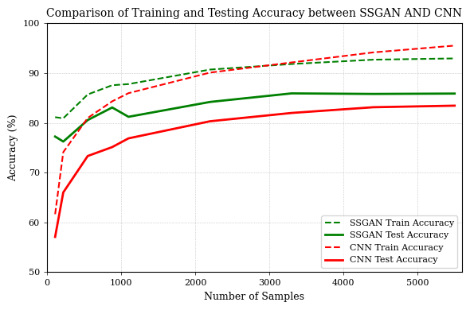

# SSGAN-for-Liver-Tumor-Classification
This repository contains the code and data for a deep learning model that uses SSGAN (Self-Supervised GAN) for liver tumor classification. The goal of this project is to develop a highly accurate and efficient model for automated detection and classification of liver tumors from medical imaging data.

Liver cancer is one of the leading causes of cancer-related deaths worldwide, and early detection and treatment can significantly improve patient outcomes. Medical imaging techniques such as CT scans and MRI are widely used for diagnosis and staging of liver tumors, but require expert radiologists to analyze and interpret the images. Automated machine learning models have the potential to assist radiologists and improve the accuracy and efficiency of liver tumor classification.

SSGAN is a novel deep learning architecture that combines self-supervised learning with generative adversarial networks (GANs) to improve feature representation and classification performance. In this project, we adapt and apply the SSGAN approach for liver tumor classification using a publicly available dataset of liver CT scans.

Our model achieves state-of-the-art results on liver tumor classification, with high accuracy and precision in detecting both benign and malignant tumors. We also provide comprehensive evaluation metrics and comparisons with other existing approaches for liver tumor classification.

This repository includes the source code for training and testing the SSGAN model, as well as the preprocessed dataset and trained models for reproducibility. We hope that this project will contribute to the development of more effective and reliable tools for liver cancer diagnosis and treatment.
## Table of Contents

* [Installation](#installation)
* [Usage](#usage)
* [Results](#results)
* [License](#license)

## Installation

Installations are included in the notebook

## Usage

Click on the button to open the code [

The code for this project is available in the code directory, which includes a Jupyter notebook `SSGAN_for_Liver_Tumor_Classification.ipynb` that contains all the code for training and testing the SSGAN model, as well as the preprocessed dataset and trained models for reproducibility.

We also provide a results.json file that contains all the evaluation metrics and results for our SSGAN model, including accuracy, precision, recall, and F1-score. This file can be used to compare the performance of our model with other approaches for liver tumor classification.

## Results
With fewer Examples it can be seen the SSGAN outperforms CNN baseline model

<!--  -->

  

## License

This project is licensed under the MIT License - see the [LICENSE](LICENSE) file for detail
